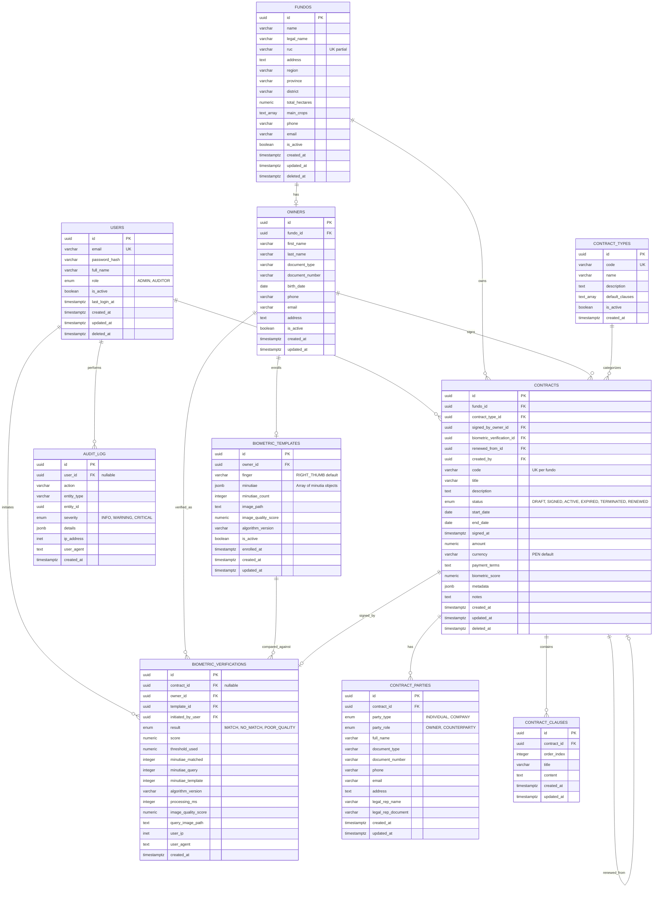
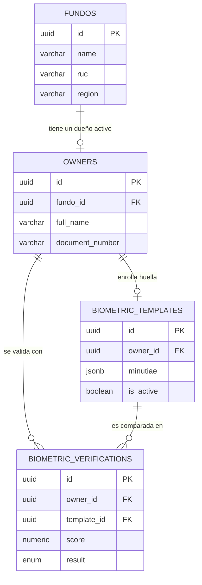
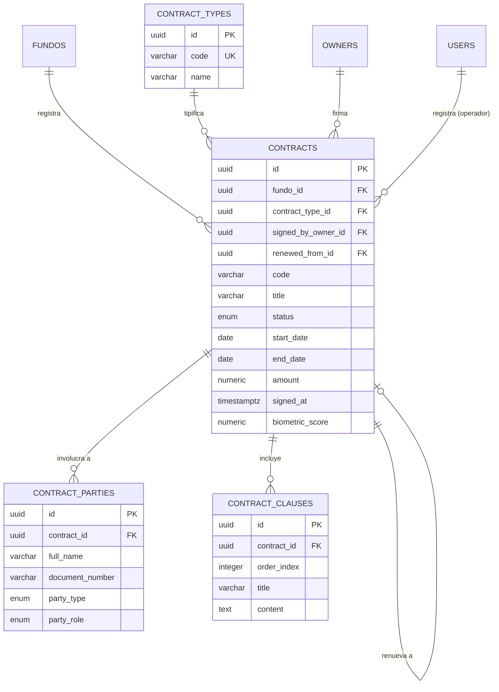
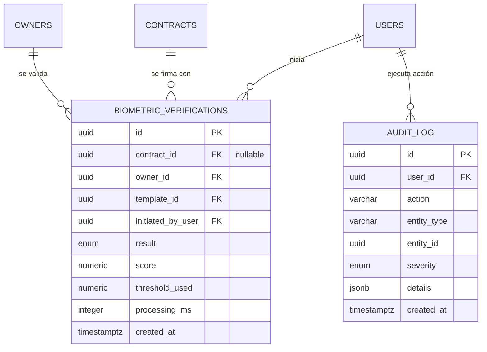
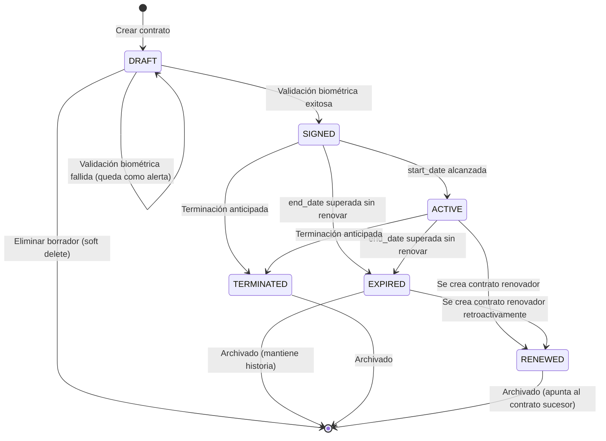
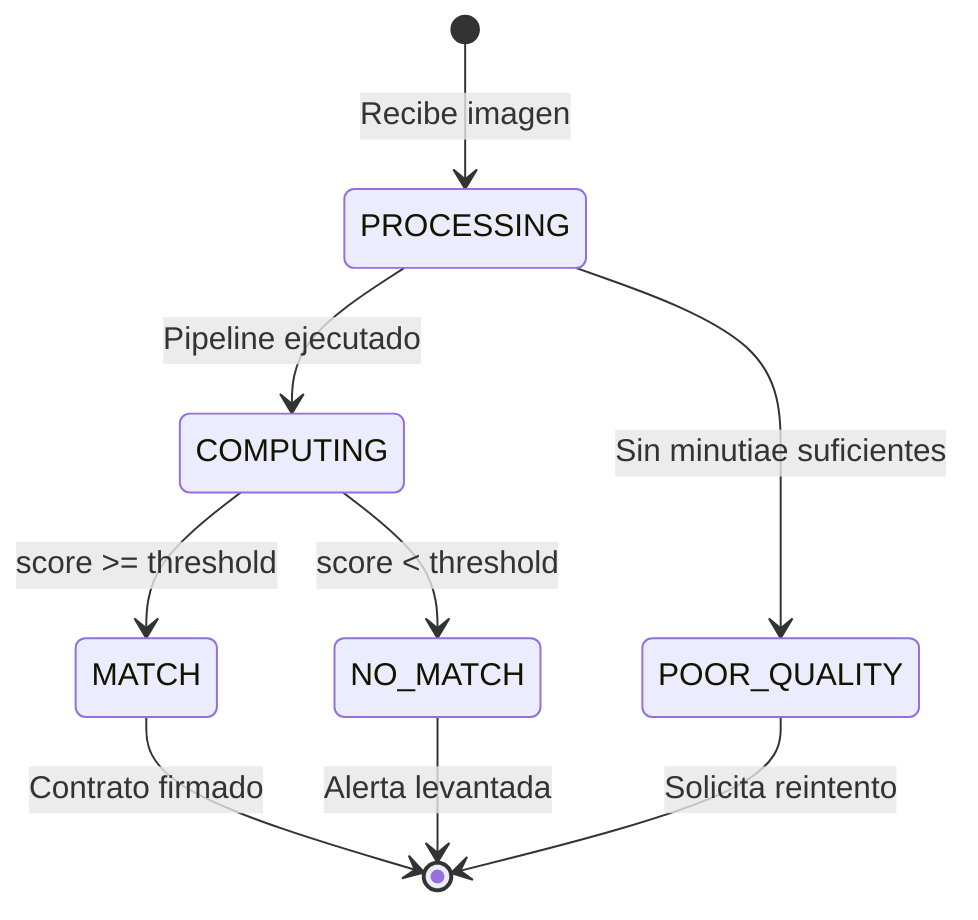

# Diagrama de Base de Datos (ER)

**Proyecto:** Sistema de Gestión de Contratos con Validación Biométrica por Huella Digital
**Notación:** Entity-Relationship en Mermaid + complemento textual
**Versión:** 1.0
**Documento relacionado:** `03-modelo-bd.md` (definiciones SQL completas)

---

## 1. Cómo leer este documento

Este archivo contiene **tres vistas complementarias** del modelo de datos:

1. **Diagrama ER completo** — Mermaid con todas las tablas, columnas clave y relaciones
2. **Diagrama por dominio** — Tres diagramas más pequeños separados por responsabilidad
3. **Tablas de relaciones** — Cardinalidad explícita y reglas de integridad

Los diagramas Mermaid se renderizan directamente en GitHub, GitLab, VS Code (con extensión Mermaid), Notion, Obsidian y en el sitio Astro Starlight del proyecto. Si necesitas exportarlo como imagen PNG/SVG para entregar en formato no-Mermaid, usa `mermaid-cli` (`npm install -g @mermaid-js/mermaid-cli` y luego `mmdc -i diagrama.mmd -o diagrama.svg`).

---

## 2. Diagrama ER completo



---

## 3. Diagramas por dominio

Para facilitar la lectura, el modelo se descompone en tres dominios. Cada diagrama enfoca un subconjunto coherente.

### 3.1 Dominio: Organización y biometría

Cómo se relaciona un fundo con su dueño y su plantilla biométrica.



**Reglas clave de este dominio:**
- Un `fundo` tiene exactamente un `owner` activo a la vez (constraint único parcial sobre `owners.fundo_id WHERE is_active = TRUE`).
- Un `owner` tiene exactamente una `biometric_template` activa por dedo (constraint único parcial sobre `(owner_id, finger) WHERE is_active = TRUE`).
- Cada `biometric_verification` deja huella permanente, sea exitosa o fallida. Nunca se elimina (`ON DELETE RESTRICT`).

### 3.2 Dominio: Contratos

El corazón funcional del sistema.



**Reglas clave de este dominio:**
- `code` es único **por fundo**, no globalmente. Permite que cada fundo lleve su propia numeración (`CTR-2026-001`).
- El `CHECK` constraint `chk_signed_requires_owner` garantiza que un contrato con status `SIGNED/ACTIVE/EXPIRED/TERMINATED/RENEWED` debe tener `signed_by_owner_id`, `signed_at` y `biometric_score` poblados. Es imposible marcar un contrato como firmado sin pasar por el flujo biométrico.
- `renewed_from_id` es auto-referencia: un contrato nuevo puede apuntar al contrato original que renueva. Permite trazar la historia completa de renovaciones.
- `ON DELETE CASCADE` en `contract_parties` y `contract_clauses`: si se borra un contrato (soft delete), sus partes y cláusulas también se eliminan lógicamente.

### 3.3 Dominio: Auditoría y trazabilidad

Cómo todo el sistema queda auditable.



**Reglas clave de este dominio:**
- `audit_log` no tiene FK estricta a las entidades que registra (`entity_id` es UUID sin constraint). Esto es deliberado: si se borra una entidad, su historial de auditoría debe persistir.
- `biometric_verifications.contract_id` es nullable: permite registrar intentos de validación que no estuvieron asociados a un contrato (pruebas, ataques, enrollments).
- Ambas tablas tienen índice sobre `created_at DESC` para consultas cronológicas rápidas.

---

## 4. Tabla de relaciones y cardinalidad

Lectura: "Una fila de A se relaciona con N filas de B".

| Tabla A | Cardinalidad | Tabla B | Relación lógica | Constraint en BD |
|---|---|---|---|---|
| `users` | 1 → N | `contracts` | Un usuario operador puede crear muchos contratos | `contracts.created_by FK` |
| `users` | 1 → N | `biometric_verifications` | Un operador puede iniciar muchas verificaciones | `biometric_verifications.initiated_by_user FK` |
| `users` | 1 → N | `audit_log` | Un usuario genera muchos eventos de auditoría | `audit_log.user_id FK (nullable)` |
| `fundos` | 1 → 1 | `owners` | Un fundo tiene un solo dueño activo | UNIQUE parcial `WHERE is_active = TRUE` |
| `fundos` | 1 → N | `contracts` | Un fundo tiene muchos contratos | `contracts.fundo_id FK` |
| `owners` | 1 → 1 | `biometric_templates` | Un dueño tiene una plantilla activa por dedo | UNIQUE parcial `(owner_id, finger) WHERE is_active = TRUE` |
| `owners` | 1 → N | `biometric_verifications` | Un dueño tiene muchos intentos históricos | `biometric_verifications.owner_id FK` |
| `owners` | 1 → N | `contracts` | Un dueño firma muchos contratos | `contracts.signed_by_owner_id FK (nullable hasta firma)` |
| `biometric_templates` | 1 → N | `biometric_verifications` | Una plantilla se compara muchas veces | `biometric_verifications.template_id FK` |
| `contract_types` | 1 → N | `contracts` | Un tipo categoriza muchos contratos | `contracts.contract_type_id FK` |
| `contracts` | 1 → N | `contract_parties` | Un contrato tiene muchas partes | `contract_parties.contract_id FK ON DELETE CASCADE` |
| `contracts` | 1 → N | `contract_clauses` | Un contrato tiene muchas cláusulas | `contract_clauses.contract_id FK ON DELETE CASCADE` |
| `contracts` | 1 → 1 | `biometric_verifications` | Un contrato firmado apunta a la verificación que lo firmó | `contracts.biometric_verification_id FK (nullable)` |
| `contracts` | 1 → 1 | `contracts` | Un contrato puede renovar a otro | `contracts.renewed_from_id FK auto-referencia` |

---

## 5. Reglas de integridad documentadas

Esta sección consolida en un solo lugar las garantías que el esquema ofrece. Útil para revisar antes de implementar lógica de negocio que pueda violarlas inadvertidamente.

### 5.1 Integridad referencial

| Caso | Política | Justificación |
|---|---|---|
| Borrar un fundo con dueño | `RESTRICT` (no permite) | Un fundo con historia contractual no debe poder eliminarse físicamente |
| Borrar un fundo con contratos | `RESTRICT` | Misma razón. Usar soft delete (`deleted_at`) |
| Borrar un dueño con plantillas | `CASCADE` (elimina plantillas) | Las plantillas pertenecen al dueño; sin dueño pierden sentido |
| Borrar un dueño con verificaciones | `RESTRICT` | La auditoría histórica debe persistir |
| Borrar una plantilla con verificaciones | `RESTRICT` | Las verificaciones necesitan saber contra qué plantilla se hicieron |
| Borrar un usuario con auditoría | `SET NULL` en `audit_log.user_id` | El evento de auditoría persiste aunque el usuario ya no exista |
| Borrar un contrato con partes/cláusulas | `CASCADE` | Las partes y cláusulas pertenecen al contrato |
| Borrar un contrato con verificación de firma | `SET NULL` en `biometric_verifications.contract_id` | La verificación persiste (auditoría) |
| Borrar un contrato renovado por otro | `SET NULL` en `contracts.renewed_from_id` | El contrato renovado no debería perderse, pero pierde la referencia al original |

### 5.2 Integridad de dominio (CHECK constraints)

| Tabla | Constraint | Garantiza |
|---|---|---|
| `contracts` | `chk_dates_valid` | `end_date >= start_date` |
| `contracts` | `chk_amount_positive` | `amount IS NULL OR amount >= 0` |
| `contracts` | `chk_score_range` | `biometric_score IS NULL OR (biometric_score >= 0 AND biometric_score <= 1)` |
| `contracts` | `chk_signed_requires_owner` | Un contrato en estado firmado/activo/etc. tiene owner, fecha y score |
| `biometric_templates` | `chk_minutiae_count_positive` | Una plantilla siempre tiene al menos 1 minutia |
| `biometric_templates` | `chk_quality_range` | Quality score entre 0 y 1 si está presente |
| `biometric_verifications` | `chk_score_range` | Score entre 0 y 1 |
| `biometric_verifications` | `chk_threshold_range` | Threshold entre 0 y 1 |
| `biometric_verifications` | `chk_minutiae_non_negative` | Contadores de minutiae nunca negativos |
| `biometric_verifications` | `chk_matched_consistency` | `minutiae_matched <= LEAST(minutiae_query, minutiae_template)` |
| `contract_clauses` | `chk_order_positive` | `order_index > 0` |
| `contract_parties` | `chk_company_has_rep` | Una empresa debe tener representante legal |

### 5.3 Unicidad parcial

Las uniques con cláusula `WHERE` permiten "reutilizar" valores cuando una fila está marcada como inactiva o eliminada:

| Constraint | Significado |
|---|---|
| `idx_users_email WHERE deleted_at IS NULL` | Un email único entre usuarios activos; al borrar uno, su email puede reutilizarse |
| `idx_fundos_ruc WHERE ruc IS NOT NULL AND deleted_at IS NULL` | RUC único entre fundos activos |
| `idx_owners_fundo WHERE is_active = TRUE` | Un solo dueño activo por fundo |
| `idx_bio_templates_owner_finger_active WHERE is_active = TRUE` | Una sola plantilla activa por dedo |
| `idx_contracts_code_per_fundo WHERE deleted_at IS NULL` | Código de contrato único dentro de cada fundo |

---

## 6. Estados y transiciones de un contrato

Diagrama de estados del campo `contracts.status`:



**Reglas de transición:**
- `DRAFT → SIGNED` solo es posible vía endpoint de firma biométrica con validación exitosa. La lógica vive en `ContractService.sign()`.
- `SIGNED → ACTIVE` puede ser manual o automático con un job diario.
- Las transiciones a `EXPIRED` son automáticas por job (ver script `evaluate_biometric.py` en estructura de proyecto).
- `RENEWED` requiere que exista otro contrato con `renewed_from_id` apuntando al original.

---

## 7. Estados y transiciones de una verificación biométrica



**Lo que se persiste:** El estado `PROCESSING` y `COMPUTING` son transitorios. Solo se guarda en BD el resultado final: `MATCH`, `NO_MATCH` o `POOR_QUALITY`. Esto se refleja en el ENUM `biometric_result`.

---

## 8. Notas sobre el dato JSONB `minutiae`

El campo más particular del esquema. Aquí su estructura formal:

```typescript
// Una minutia individual
type Minutia = {
  x: number;          // Coordenada X en píxeles, 0 = borde izquierdo
  y: number;          // Coordenada Y en píxeles, 0 = borde superior
  theta: number;      // Orientación de la cresta en radianes [0, 2π]
  type: "TERMINATION" | "BIFURCATION";
  quality: number;    // [0, 1] confianza en la detección
};

// El JSONB completo es:
type MinutiaeTemplate = Minutia[];
```

**Ejemplo completo de fila en `biometric_templates`:**

```json
{
  "id": "550e8400-e29b-41d4-a716-446655440000",
  "owner_id": "660e8400-e29b-41d4-a716-446655440001",
  "finger": "RIGHT_THUMB",
  "minutiae": [
    { "x": 142, "y": 87,  "theta": 1.57, "type": "TERMINATION", "quality": 0.85 },
    { "x": 203, "y": 156, "theta": 2.31, "type": "BIFURCATION", "quality": 0.91 },
    { "x": 178, "y": 234, "theta": 0.78, "type": "TERMINATION", "quality": 0.76 }
  ],
  "minutiae_count": 3,
  "image_path": "storage/fingerprints/enrolled/550e8400-thumb.png",
  "image_quality_score": 0.82,
  "algorithm_version": "v1.0-gabor-zhang-suen",
  "is_active": true,
  "enrolled_at": "2026-05-14T10:23:00Z"
}
```

> **Producción real:** En despliegue productivo, el campo `minutiae` se cifraría con `pgcrypto`. Para MVP académico se mantiene en claro y se documenta como deuda técnica explícita.

---

## 9. Índices: por qué cada uno existe

Los índices son tan importantes como las tablas. Cada uno responde a una consulta concreta que el sistema hace.

| Índice | Consulta que optimiza |
|---|---|
| `idx_users_email` | Login: buscar usuario por email |
| `idx_users_role` | Filtrar operadores por rol (panel admin) |
| `idx_fundos_active` | Listar fundos activos en dashboard |
| `idx_owners_fundo_lookup` | "Dame el dueño de este fundo" |
| `idx_owners_document` | Buscar dueño por DNI |
| `idx_bio_templates_owner` | "Dame la plantilla activa de este dueño" |
| `idx_contracts_code_per_fundo` | Buscar contrato por su código dentro del fundo |
| `idx_contracts_fundo_status` | Dashboard: contratos por estado del fundo |
| `idx_contracts_status` | Reportes globales por estado |
| `idx_contracts_end_date` | Alertas de vencimiento (parcial: solo SIGNED/ACTIVE) |
| `idx_contracts_type` | Filtrar contratos por tipo (UI) |
| `idx_parties_contract` | Cargar partes de un contrato (JOIN en detalle) |
| `idx_parties_document` | Buscar todos los contratos donde aparece una persona/empresa |
| `idx_clauses_contract_order` | Mostrar cláusulas ordenadas en detalle |
| `idx_bio_verif_contract` | Historial biométrico de un contrato |
| `idx_bio_verif_owner` | Historial biométrico de un dueño |
| `idx_bio_verif_result` | Reporte de fallos vs éxitos |
| `idx_bio_verif_created` | Timeline cronológico de verificaciones |
| `idx_bio_verif_failed` | Alertas: fallos recientes por dueño |
| `idx_audit_user` | Acciones de un usuario específico |
| `idx_audit_entity` | Historial de cambios sobre una entidad |
| `idx_audit_severity` | Panel de alertas críticas |
| `idx_audit_created` | Timeline de auditoría |

---

## 10. Cómo exportar el diagrama a otros formatos

Si necesitas entregar el diagrama como imagen estática (PNG/SVG/PDF) para informes Word o presentaciones:

```bash
# Instalar mermaid-cli
npm install -g @mermaid-js/mermaid-cli

# Exportar a SVG (vectorial, escala sin pérdida)
mmdc -i diagrama.mmd -o diagrama.svg

# Exportar a PNG con resolución alta
mmdc -i diagrama.mmd -o diagrama.png -w 2400 -H 1800

# Exportar a PDF
mmdc -i diagrama.mmd -o diagrama.pdf
```

Alternativas online sin instalar nada:
- **Mermaid Live Editor:** https://mermaid.live — pegas el código, descargas SVG/PNG
- **GitHub/GitLab/Notion:** renderizan Mermaid nativo en markdown
- **dbdiagram.io:** si prefieres notación DBML (alternativa a Mermaid para ER)

---

## 11. Convivencia con el chatbot RAG (futuro)

Como nota arquitectónica para el trabajo futuro: el chatbot RAG (documentado por separado en `Documentacion_Tecnica_Chatbot.docx`) usaría un vector store (ChromaDB) **independiente** de PostgreSQL. No comparte esquema con esta BD. Si en el futuro el chatbot se embebe en el sistema (escenario opcional D), la integración sería:

- El chatbot consume contratos vía API REST del backend (no toca PostgreSQL directamente)
- Cuando se crea/actualiza un contrato, el backend emite un evento que dispara re-indexación de embeddings
- El vector store guarda solo embeddings + metadatos mínimos (contract_id, chunk_id, fragmento de texto)
- Consultas del chatbot que necesitan datos estructurados van al API REST normal

Esto mantiene la BD relacional limpia y permite que la capa vectorial evolucione independiente.

---

## 12. Checklist de validación del modelo

Antes de implementar, verifica que el modelo cumple:

- [ ] Toda tabla tiene PK
- [ ] Toda FK tiene su política `ON DELETE` definida explícitamente
- [ ] Toda columna nullable está justificada (¿por qué puede ser NULL?)
- [ ] Toda columna NOT NULL sin default puede poblarse en todos los flujos de inserción
- [ ] Los ENUMs cubren todos los estados conocidos del negocio
- [ ] Los CHECK constraints capturan reglas de dominio críticas
- [ ] Los índices cubren las consultas de los casos de uso del documento de análisis de negocio
- [ ] Toda tabla auditable tiene `created_at`/`updated_at`
- [ ] Las uniques tienen filtros parciales cuando aplica (`WHERE deleted_at IS NULL`)
- [ ] No hay claves naturales como PK (todas son UUID)
- [ ] Los nombres son consistentes con la convención del proyecto

---

## 13. Resumen visual de un solo párrafo

Tres dominios conectados: **organización** (fundos, dueños, plantillas biométricas), **contratos** (contratos, partes, cláusulas, tipos), y **auditoría** (verificaciones biométricas, log). Los contratos son el centro funcional, atravesados por la firma biométrica que vincula al dueño con su plantilla maestra a través de una verificación que queda registrada para siempre. La auditoría es transversal y captura cada cambio relevante. El esquema garantiza con constraints que ningún contrato puede marcarse como firmado sin haber pasado por el pipeline biométrico, y que ningún intento biométrico se pierde, sea exitoso o fallido.
